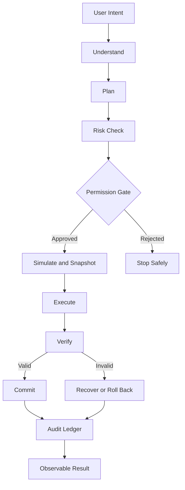
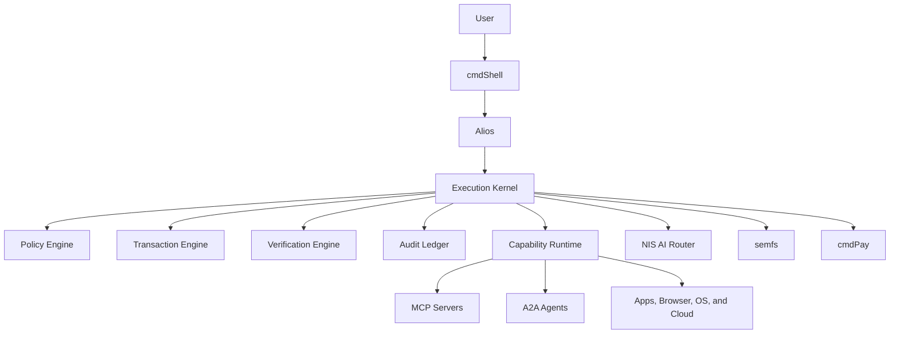

[](https://cmdos.xyz/)

[](https://github.com/cmdOSxyz/foundation)

# cmdOS

## The Operating System for AI Agents

**Turn human intent into safe, observable, and reversible execution.**

[](https://github.com/cmdOSxyz/foundation)
[](LICENSE)
[](#development)
[](#architecture)

[Website](https://cmdos.xyz/) · [Documentation](docs/) · [Roadmap](ROADMAP.md) · [Issues](https://github.com/cmdOSxyz/foundation/issues)

---

> [!IMPORTANT]
> **cmdOS is under active development.**
>
> This repository contains architecture, specifications, core modules, behavior contracts, and a runnable reference prototype. Interfaces may evolve as the execution kernel matures.

---

## Overview

cmdOS is an **AI-native execution environment**.

Users describe the outcome they want. cmdOS plans the work, checks permissions, executes through controlled capabilities, verifies the result, and records what happened.

> **You describe the outcome. cmdOS handles the execution path.**

```text
Intent
  ↓
Plan
  ↓
Permission
  ↓
Execution
  ↓
Verification
  ↓
Recovery
```

The first product is **cmdOS Layer**, a desktop application for Windows, macOS, and Linux.

The long-term goal is a complete AI-native operating system.

---

## Why cmdOS

Most AI products can explain how to complete a task, but the user still performs the work manually.

cmdOS is designed to manage the complete execution lifecycle:

- Understand the real goal.
- Build a structured plan.
- Select the correct capabilities.
- Evaluate risk before acting.
- Request approval when needed.
- Execute across applications and services.
- Verify the real-world result.
- Recover from mistakes when possible.
- Record every consequential action.

cmdOS treats AI execution as an **operating-system problem**, not only as a chatbot feature.

---

## Core Principles

### Intent First

Describe the desired outcome instead of operating every interface manually.

### Observable

Keep plans, approvals, actions, progress, and results visible.

### Governed

Enforce permissions, budgets, and limits below the AI model.

### Reversible

Prepare recovery before changing external state.

### Verified

Confirm real outcomes instead of trusting tool responses alone.

### Open

Extend the system through protocols, capabilities, and agents.

---

## Execution Lifecycle



### 1. Intent

Capture the desired outcome, constraints, and context.

### 2. Plan

Build a structured execution graph.

### 3. Risk

Classify the impact and determine approval requirements.

### 4. Permission

Enforce policies, budgets, and capability limits.

### 5. Execution

Perform approved actions through controlled capabilities.

### 6. Verification

Confirm that the real result matches the original intent.

### 7. Recovery

Commit valid results, compensate for errors, or roll back when possible.

### 8. Ledger

Record actions, evidence, approvals, and outcomes.

---

## Core System

### Alios

**Alios** is the resident Prime Agent.

It is responsible for:

- Understanding user intent.
- Building execution plans.
- Coordinating capabilities and sub-agents.
- Explaining risk and approval requirements.
- Returning an observable result.

Alios can propose actions, but it cannot bypass kernel policy or permission boundaries.

### Execution Kernel

The kernel controls:

- Scheduling.
- Transactions.
- Risk classification.
- Permission enforcement.
- Verification.
- Recovery.
- Audit records.

### Capability Runtime

The capability runtime connects cmdOS to:

- Desktop applications.
- Browsers.
- Operating-system functions.
- Cloud services.
- MCP servers.
- A2A agents.

### Audit Ledger

The ledger records:

- The original intent.
- The approved plan.
- Executed actions.
- Evidence and outputs.
- Verification results.
- Recovery state.

---

## Architecture



### cmdShell

The user interface for intents, plans, approvals, execution status, and results.

### NIS

The AI model routing and inference layer.

### semfs

Semantic file and storage services.

### cmdPay

Payment mandates, budget limits, and controlled financial execution.

---

## Trust and Security

cmdOS assumes that models, prompts, tools, and external data can fail or become adversarial.

Security therefore depends on system boundaries, not on model behavior alone.

### Risk Levels

#### R0 — Observe

Read-only actions that can usually run autonomously.

#### R1 — Low Impact

Reversible changes with logging and limited scope.

#### R2 — Material

Actions that normally require preview and approval.

#### R3 — Critical

High-risk or irreversible actions requiring explicit confirmation.

### Security Rules

- Enforce policy below the AI model.
- Scope every capability to minimum required access.
- Require approval for consequential actions.
- Verify external results after execution.
- Record every important action.
- Prepare recovery before mutation.
- Keep identity and trust local-first.

> [!WARNING]
> Not every external system supports perfect rollback.
>
> cmdOS distinguishes between true reversal, compensating actions, and irreversible but auditable operations.

---

## Open Protocols

### MCP

Capability and tool interoperability.

### A2A

Agent identity, delegation, and coordination.

### Shared Schemas

Contracts across the shell, runtime, services, and capabilities.

### Capability Servers

Extensions that add functionality without expanding the core unnecessarily.

---

## Repository Structure

```text
.
├── agent/
│   └── alios/          # Prime Agent
├── capabilities/       # First-party MCP servers
├── docs/               # Strategy, RFCs, specs, and governance
├── kernel/             # Rust execution core
├── prototype/          # Runnable reference implementation
├── schemas/            # Shared TypeScript contracts
├── services/           # semfs, NIS, aipc, and cmdPay
└── shell/              # cmdShell user interface
```

---

## Quick Start

### Reference Prototype

```bash
npm install
npm test
npm start
```

### Rust Workspace

```bash
cargo build --workspace
```

---

## Development

cmdOS follows a specification-led and RFC-driven workflow.

```text
Idea → RFC → Review → Implementation → Tests → Documentation
```

Before making architectural changes:

1. Read `ROADMAP.md`.
2. Review the relevant documentation.
3. Read `docs/rfcs/0000-rfc-process.md`.
4. Document security and trust implications.
5. Keep behavior observable and testable.

---

## Roadmap

### Horizon 1 — cmdOS Layer

Desktop execution layer for Windows, macOS, and Linux.

### Horizon 2 — Runtime Ownership

Own the agent runtime, execution model, and trust boundaries.

### Horizon 3 — AI-Native Userspace

Move from an application layer to a complete AI-first environment.

### Horizon 4 — Full cmdOS

A Linux-based operating system where AI-native execution is a system primitive.

See [`ROADMAP.md`](ROADMAP.md) for the complete roadmap.

---

## Project Status

### Available Now

- Architecture and strategy.
- RFC process.
- Repository structure.
- Reference prototype.
- Behavior contracts.
- Early core modules.

### In Progress

- Execution kernel semantics.
- Policy model.
- Capability boundaries.
- Verification and recovery.
- Shell experience.
- Service interfaces.

### Long-Term Direction

- AI-native userspace.
- Complete operating system.
- Broader capability ecosystem.
- Deeper device integration.
- Secure multi-agent execution.

---

## Documentation

- [Project Documentation](docs/)
- [Roadmap](ROADMAP.md)
- [RFC Process](docs/rfcs/0000-rfc-process.md)
- [Project Strategy](docs/01-vision/strategy-v2.md)

---

## Contributing

Contributions are welcome from developers interested in:

- AI infrastructure.
- Operating systems.
- Agent runtimes.
- Capability protocols.
- Security architecture.
- Local-first software.
- Interaction design.

Read the relevant documentation and open an RFC or issue before making major architectural changes.

---

## Community

- [Website](https://cmdos.xyz/)
- [X / Twitter](https://x.com/cmdOS_xyz)
- [Telegram](https://t.me/cmdOS_xyz)
- [GitHub Issues](https://github.com/cmdOSxyz/foundation/issues)

---

## License

MIT.

---

## cmdOS

**The Operating System for AI Agents.**

Plan. Approve. Execute. Verify. Recover.
