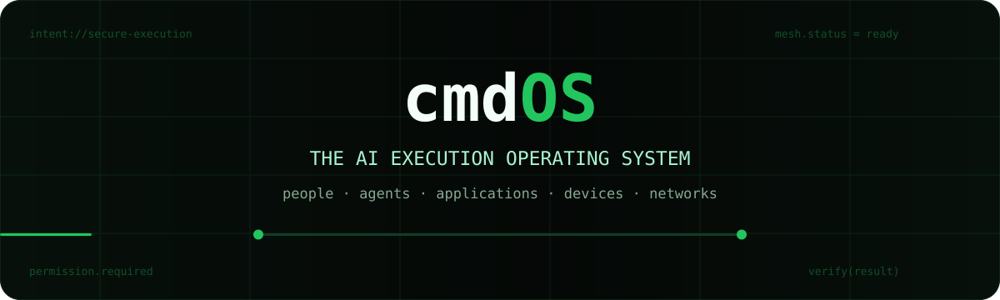
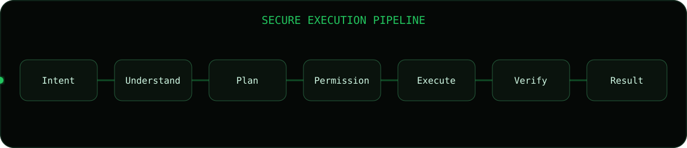
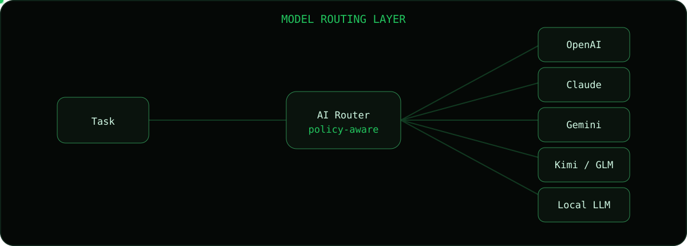
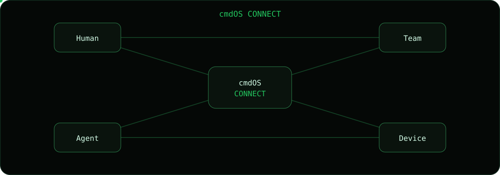
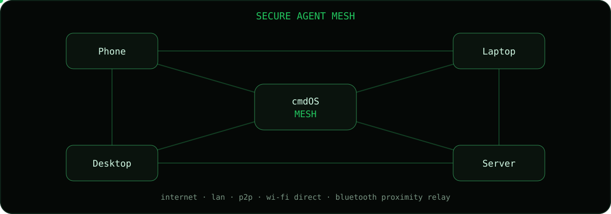
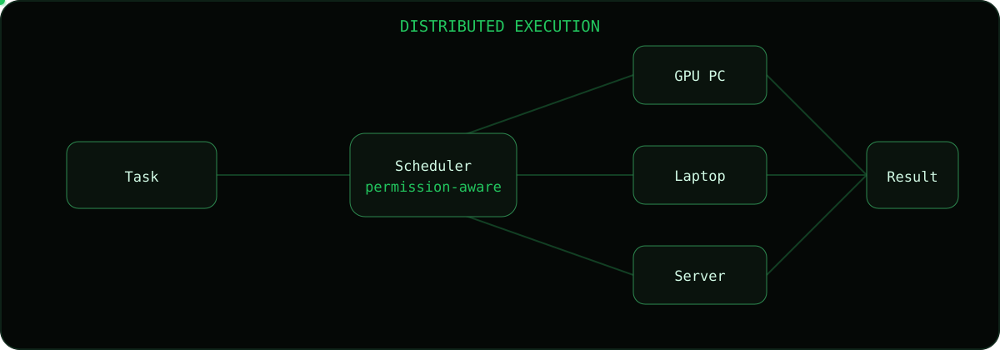
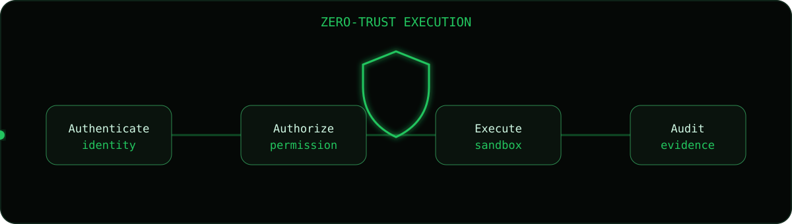

<div align="center">



<br/>

# cmdOS

### The Operating System for AI Agents

**A secure operating layer where people and AI agents communicate, collaborate, and execute real-world work across applications, devices, local networks, and cloud infrastructure.**

[](#project-status)
[](#local-first-by-design)
[](#cmdos-connect)
[](#secure-agent-mesh)

<br/>

[Vision](#vision) · [What Runs Today](#what-runs-today) · [Features](#core-capabilities) · [cmdOS Connect](#cmdos-connect) · [Architecture](#architecture) · [Roadmap](#roadmap) · [Security](#security-model)

</div>

---

## Vision

cmdOS is being designed as an AI-native execution operating system.

Instead of stopping at generated text, cmdOS is intended to help users move from **intent** to **verified action**:

```text
Intent → Understanding → Planning → Permission → Execution → Verification → Result
```

Its broader product vision combines three core layers:

```text
1. AI Execution
2. Human Communication
3. Secure Agent Mesh
```

Together, these layers allow people and AI agents to work inside one secure environment.

---

## Why cmdOS?

Most AI products end at conversation.

cmdOS is designed to continue beyond conversation by connecting:

```text
People ↔ AI Agents ↔ Applications ↔ Devices ↔ Networks ↔ Results
```

The goal is to make AI useful not only for answering questions, but also for:

- executing approved tasks;
- coordinating multiple agents;
- operating tools and applications;
- collaborating with other users;
- transferring files and workflows securely;
- distributing work across trusted devices;
- verifying whether the requested outcome was actually achieved.

> cmdOS is not positioned as another chatbot.  
> It is positioned as the secure execution and communication layer for people, agents, applications, and devices.

---

## Product Pillars

<div align="center">

| AI Execution | Human Communication | Secure Agent Mesh |
|---|---|---|
| Turn natural language into real actions | Chat privately with people and teams | Connect trusted users, agents, and devices |
| Plan, authorize, execute, and verify | Use AI directly inside conversations | Support local, peer-to-peer, and relay-based communication |
| Route tasks to the right model or agent | Share files, prompts, workflows, and results | Enable distributed execution across trusted nodes |

</div>

---

## Execution Pipeline

<div align="center">
  
</div>

### 1. Intent

The user describes the desired outcome in natural language.

```text
"Prepare the weekly report, verify the figures,
send it to the team, and notify me after delivery."
```

### 2. Understanding

cmdOS identifies:

- the user goal;
- required context;
- constraints;
- sensitive actions;
- expected result;
- possible execution risks.

### 3. Planning

The planner creates an execution graph containing:

- steps;
- tools;
- agents;
- dependencies;
- approval checkpoints;
- fallback paths;
- verification rules.

### 4. Permission

Sensitive actions are paused until the user approves them.

Examples:

- sending a message;
- publishing content;
- deleting files;
- executing shell commands;
- spending money;
- controlling another device;
- sharing protected information.

### 5. Execution

Authorized agents operate approved tools and environments.

### 6. Verification

cmdOS checks whether the target state was reached.

### 7. Result

The user receives:

- the final output;
- supporting evidence;
- execution status;
- failures or warnings;
- an auditable action trace.

---

# Core Capabilities

## AI Agent Runtime

The Agent Runtime is intended to coordinate specialized agents across local and remote environments.

### Planned agent types

- Browser Agent
- Desktop Agent
- Terminal Agent
- Mobile Agent
- File Agent
- Communication Agent
- Cloud Agent
- Research Agent
- Coding Agent
- Verification Agent
- Security Agent
- Device Agent

### Runtime responsibilities

- task delegation;
- agent lifecycle management;
- tool access control;
- sandboxing;
- state transitions;
- retries and recovery;
- resource limits;
- approval gates;
- structured execution logs;
- result verification.

---

## Multi-Agent Orchestration

cmdOS is designed to allow multiple agents to cooperate on one goal.

```text
User Intent
   ↓
Planner Agent
   ├── Research Agent
   ├── Browser Agent
   ├── Coding Agent
   ├── File Agent
   └── Verification Agent
   ↓
Verified Result
```

Agents may:

- split complex goals into subtasks;
- work in parallel;
- delegate work;
- exchange structured state;
- request human approval;
- recover from failed steps;
- return evidence with results.

---

## AI Router

<div align="center">
  
</div>

The AI Router is intended to select the most appropriate model for each task.

Routing factors may include:

- model capability;
- latency;
- cost;
- privacy requirements;
- tool support;
- context length;
- availability;
- local hardware;
- user preference;
- organization policy.

### Target provider categories

- OpenAI models
- Anthropic Claude
- Google Gemini
- Kimi
- GLM
- local LLMs
- specialized task models

cmdOS should remain provider-flexible rather than depending on a single model vendor.

---

# cmdOS Connect

<div align="center">
  
</div>

**cmdOS Connect** is the integrated communication layer for people, teams, agents, and devices.

It is not limited to Agent-to-Agent messaging.

It is intended to support:

```text
Human ↔ Human
Human ↔ AI Agent
AI Agent ↔ AI Agent
Team ↔ AI Agents
Device ↔ Device
```

---

## Human-to-Human Messaging

### Direct messages

- one-to-one private chat;
- optional username-based identity;
- optional device or public-key identity;
- no mandatory phone number;
- encrypted conversations;
- read receipts that can be disabled;
- typing indicators that can be disabled;
- online status that can be hidden;
- message requests;
- block and report controls.

### Group chat

- private groups;
- public channels;
- team workspaces;
- project rooms;
- topic-based channels;
- temporary rooms;
- local-only rooms;
- invite-only rooms;
- password-protected rooms;
- member roles and permissions.

### Message features

- reply;
- quote reply;
- reactions;
- mentions using `@username`;
- message editing;
- delete for self;
- delete for all participants where allowed;
- pinned messages;
- favorites;
- bookmarks;
- message search;
- message forwarding;
- draft messages;
- scheduled messages;
- disappearing messages;
- expiration policies;
- thread-based discussion;
- polls;
- announcements.

### Media and file sharing

- images;
- videos;
- voice messages;
- documents;
- folders;
- code files;
- archives;
- prompts;
- workflows;
- execution reports;
- agent outputs;
- verified result packages.

Planned transfer controls include:

- encryption in transit;
- integrity verification;
- resumable transfer;
- recipient approval;
- file type restrictions;
- size restrictions;
- automatic expiration;
- malware scanning hooks;
- local-only sharing options.

### Calls and collaboration

Planned capabilities:

- voice calls;
- video calls;
- screen sharing;
- live collaboration rooms;
- remote assistance sessions;
- AI-generated meeting notes;
- live translation;
- conversation summaries;
- action-item extraction.

---

## AI Inside Conversations

AI agents can be invited into a conversation as active collaborators.

### Example

```text
Thomas:
@research-agent summarize today's discussion
and turn the decisions into a project plan.

Research Agent:
I found 6 decisions and 11 action items.
The draft plan is ready.

Thomas:
Share it with the project room.

cmdOS:
Permission required:
Share "Project Plan v1" with 8 members?

Thomas:
Approve.

cmdOS:
Shared successfully with 8/8 members.
```

### Agent actions inside chat

Agents may be able to:

- summarize discussions;
- translate messages;
- extract action items;
- create tasks;
- prepare reports;
- analyze files;
- compare documents;
- generate meeting notes;
- schedule approved events;
- send approved emails;
- prepare code changes;
- run workflows;
- verify execution results;
- notify participants when work completes.

All sensitive actions should remain permission-controlled.

---

## Human-to-Agent Communication

Users can communicate directly with specialized agents.

Examples:

```text
@browser-agent verify the latest deployment
```

```text
@file-agent organize these documents by project
```

```text
@security-agent review the workflow before execution
```

```text
@desktop-agent open the approved report and export it as PDF
```

---

## Agent-to-Agent Communication

Agents may communicate using structured task envelopes rather than untrusted free-form messages.

Possible data exchanged:

- task definition;
- required capability;
- execution constraints;
- permission scope;
- selected tools;
- intermediate state;
- verification criteria;
- signed result;
- failure reason;
- recovery instructions.

---

# Secure Agent Mesh

<div align="center">
  
</div>

The Secure Agent Mesh is the networking layer that connects trusted users, agents, and devices.

It is intended to support both connected and partially offline environments.

## Target transports

Depending on operating-system and hardware support:

- Internet
- LAN
- peer-to-peer connections
- Wi-Fi Direct
- Bluetooth proximity communication
- trusted relay nodes
- store-and-forward delivery
- self-hosted rendezvous services

> Bluetooth, Wi-Fi Direct, background networking, and multi-hop behavior depend on platform APIs, device permissions, radio support, and operating-system restrictions.

---

## Offline Communication

Nearby devices may exchange supported data without relying on continuous internet access.

Potential offline payloads:

- encrypted messages;
- task requests;
- signed execution results;
- approved files;
- workflow definitions;
- agent capability announcements;
- device availability;
- relay envelopes.

Offline mode should use constrained permissions and clear delivery status.

---

## Multi-Hop Relay

Encrypted envelopes may be forwarded through trusted nodes.

```text
Phone A
   ↓
Laptop B
   ↓
Desktop C
   ↓
Target User or Agent
```

A relay node should not need access to message contents.

Planned relay properties:

- encrypted payload;
- authenticated sender;
- authenticated recipient;
- expiration time;
- replay protection;
- hop limit;
- delivery receipt;
- duplicate suppression;
- integrity validation.

---

## Device and User Identity

cmdOS may support multiple identity modes.

### Identity options

- local device identity;
- username identity;
- public-key identity;
- paired trusted device;
- team-managed identity;
- temporary session identity;
- anonymous local room identity.

### Pairing methods

Potential pairing methods include:

- QR code;
- short authentication code;
- proximity confirmation;
- trusted workspace invitation;
- signed device invitation;
- hardware-backed key confirmation.

---

## Capability Discovery

Trusted devices may publish limited, user-approved capability information.

```text
Thomas-PC
• RTX GPU available
• Local model ready
• Browser Agent available
• File transfer allowed
• Remote execution requires approval
```

cmdOS may use this information to route tasks intelligently.

---

# Distributed Execution

<div align="center">
  
</div>

Distributed Execution allows approved work to run across trusted devices.

Examples:

- run a local LLM on a stronger desktop;
- send a render job to a GPU workstation;
- execute a build on a development server;
- process private files on a home server;
- verify a website from another device;
- continue an approved workflow after one node disconnects;
- delegate a mobile-specific action to a paired phone.

## Distributed workflow

```text
Intent
  ↓
Planner
  ↓
Capability Discovery
  ↓
Device Selection
  ↓
Permission Check
  ↓
Encrypted Task Envelope
  ↓
Remote Agent Execution
  ↓
Verification
  ↓
Signed Result
```

## Resource sharing

Planned resource types:

- CPU;
- GPU;
- RAM;
- local models;
- storage;
- browser sessions;
- development environments;
- specialized software;
- device sensors;
- private network access.

Resource sharing must remain:

- opt-in;
- policy-controlled;
- time-limited;
- visible;
- revocable;
- auditable.

---

# Local-First by Design

cmdOS is intended to keep the user's device as the primary trust boundary.

## Local-first principles

- local execution whenever practical;
- local storage by default;
- cloud services remain optional;
- minimum necessary data disclosure;
- user-controlled retention;
- explicit permission for external transmission;
- encrypted secrets;
- removable execution history;
- no advertising identity layer;
- no silent agent execution.

## Optional infrastructure

Some features may still require optional infrastructure for:

- model APIs;
- device rendezvous;
- team administration;
- push notifications;
- encrypted backup;
- remote access;
- software updates;
- abuse prevention.

Each dependency should be clearly disclosed and configurable.

---

# Privacy Model

## Privacy goals

- no mandatory phone number;
- no required advertising profile;
- no sale of personal data;
- no hidden cross-service tracking;
- no default public identity;
- no unnecessary message indexing;
- no permanent cloud retention by default;
- no silent data export;
- no unauthorized AI training on private content.

## User controls

Planned controls include:

- per-conversation retention;
- disappearing messages;
- local-only mode;
- export and delete;
- device unlinking;
- revoke all sessions;
- disable read receipts;
- hide online status;
- disable AI participation;
- disable conversation memory;
- block external model providers;
- force local-model routing;
- restrict file access;
- restrict agent permissions.

---

# Security Model

<div align="center">
  
</div>

cmdOS follows a zero-trust execution philosophy:

```text
Every user
Every device
Every agent
Every plugin
Every tool
Every task
Every network request

must be authenticated, authorized, scoped, and auditable.
```

## Planned security controls

- capability-based permissions;
- sandboxed agent execution;
- isolated secrets;
- per-tool authorization;
- signed plugins;
- task-level policies;
- execution timeouts;
- network allowlists;
- rate limits;
- resource limits;
- human approval checkpoints;
- immutable security events;
- emergency revoke;
- device unlinking;
- session termination;
- signed execution results.

## Threats considered

- prompt injection;
- malicious plugins;
- compromised devices;
- unauthorized relays;
- replay attacks;
- task tampering;
- privilege escalation;
- data exfiltration;
- unsafe autonomous actions;
- hallucinated completion;
- identity spoofing;
- malicious file transfer;
- poisoned workflow definitions;
- insecure model providers.

## Cryptographic direction

The communication protocol should target:

- end-to-end encrypted payloads;
- authenticated peers;
- forward secrecy where practical;
- replay protection;
- key rotation;
- encrypted local storage;
- signed task envelopes;
- file integrity checks;
- secure recovery and revocation.

> No production cryptographic claim should be made until the protocol has been documented, implemented, tested, and independently reviewed.

---

# Permission System

The Permission System is the boundary between planning and action.

## Permission scopes

Possible scopes:

```text
read
write
create
modify
delete
send
publish
execute
purchase
share
connect
control-device
access-secret
use-network
```

## Approval modes

- always ask;
- ask once per task;
- ask once per session;
- allow only within a workspace;
- allow only for selected files;
- allow only for selected recipients;
- deny by default;
- organization-managed policy.

## Example approval

```text
Agent request:
Send "Q3 Financial Report.pdf" to 12 workspace members.

Requested permissions:
• Read selected file
• Encrypt file
• Send to workspace
• Create delivery receipt

[Approve once] [Always allow in this workspace] [Deny]
```

---

# Verification Engine

The Verification Engine is intended to determine whether a task truly succeeded.

## Verification methods

- target-state inspection;
- output validation;
- file existence and checksum;
- delivery receipt;
- API confirmation;
- screenshot comparison;
- structured assertion;
- unit or integration tests;
- human confirmation;
- signed remote result.

## Example

```text
Task:
Deploy the latest approved build.

Verification:
✓ Build completed
✓ Tests passed
✓ Deployment endpoint responded
✓ Version hash matches approved commit
✓ Screenshot captured
✓ Rollback point created
```

---

# Architecture

```text
┌──────────────────────────────────────────────────────────────┐
│                         USER LAYER                           │
│  Command UI · Chat · Desktop · Mobile · Web · Voice          │
├──────────────────────────────────────────────────────────────┤
│                     COMMUNICATION LAYER                      │
│  Direct Messages · Groups · Rooms · Files · Calls · AI       │
├──────────────────────────────────────────────────────────────┤
│                        INTENT LAYER                          │
│  Understanding · Context · Constraints · Risk                │
├──────────────────────────────────────────────────────────────┤
│                    ORCHESTRATION LAYER                       │
│  Planner · Router · Workflow · Recovery · Scheduling         │
├──────────────────────────────────────────────────────────────┤
│                     PERMISSION LAYER                         │
│  Policies · Approval · Secrets · Audit · Identity            │
├──────────────────────────────────────────────────────────────┤
│                       AGENT RUNTIME                          │
│  Browser · Desktop · Terminal · Mobile · Cloud · Files       │
├──────────────────────────────────────────────────────────────┤
│                   SECURE AGENT MESH                          │
│  Internet · LAN · P2P · Wi-Fi Direct · Bluetooth · Relay    │
├──────────────────────────────────────────────────────────────┤
│                    EXECUTION TARGETS                         │
│  Apps · Files · Devices · APIs · Services · Infrastructure   │
├──────────────────────────────────────────────────────────────┤
│                  VERIFICATION & LEARNING                     │
│  Evidence · Validation · Result · Local Preferences          │
└──────────────────────────────────────────────────────────────┘
```

---

# Product Modes

## Personal Mode

One user coordinates local agents across personal devices.

## Team Mode

A trusted team manages:

- users;
- rooms;
- agents;
- devices;
- workflows;
- permissions;
- logs;
- organization policy.

## Offline Mode

Supported agents and conversations continue locally or through nearby trusted nodes without continuous cloud access.

## Emergency Mode

A constrained mode designed for unreliable connectivity:

- reduced permissions;
- local communication;
- delivery receipts;
- short-lived identities;
- restricted file transfer;
- no cloud dependency where possible.

## Developer Mode

Developers can build:

- agents;
- tools;
- plugins;
- workflows;
- transport adapters;
- policy modules;
- model connectors;
- verification providers.

---

# Platform Targets

Planned targets:

- Windows
- macOS
- Linux
- Android
- iOS
- Web
- self-hosted server
- local home server
- enterprise infrastructure

Platform capability may differ due to operating-system restrictions.

---

# Plugin Ecosystem

Plugins extend cmdOS with tools and integrations.

## Plugin categories

- browser;
- desktop;
- terminal;
- files;
- communication;
- cloud;
- development;
- productivity;
- finance;
- data;
- media;
- smart devices;
- enterprise systems.

## Plugin security requirements

Every plugin should declare:

- requested permissions;
- network access;
- file access;
- secrets access;
- supported actions;
- data retention behavior;
- remote endpoints;
- verification methods;
- version and publisher identity.

---

# Suggested Repository Structure

```text
cmdOS/
├── apps/
│   ├── desktop/
│   ├── mobile/
│   ├── web/
│   └── server/
├── core/
│   ├── intent/
│   ├── planner/
│   ├── permissions/
│   ├── runtime/
│   ├── router/
│   ├── verification/
│   └── memory/
├── connect/
│   ├── messaging/
│   ├── rooms/
│   ├── calls/
│   ├── files/
│   ├── presence/
│   └── moderation/
├── network/
│   ├── identity/
│   ├── encryption/
│   ├── discovery/
│   ├── transport/
│   ├── relay/
│   └── sync/
├── agents/
│   ├── browser/
│   ├── desktop/
│   ├── terminal/
│   ├── mobile/
│   ├── files/
│   └── cloud/
├── plugins/
├── workflows/
├── packages/
├── sdk/
├── docs/
├── examples/
├── tests/
├── assets/
└── README.md
```

---

# What Runs Today

**On a developer machine, right now:**

- A Rust kernel — object model, hash-chained ledger, reversible transaction
  engine, policy gate, and a scheduler that runs plans in dependency order.
- Two working capabilities: filesystem and shell, both risk-classified, both
  reversible where reversal is honest.
- The Shadow World Engine: fork the machine copy-on-write, let the agent finish
  the work, then promote one outcome or discard it for free.
- An agent that plans an intent and runs it through all of the above.
- cmdShell, a Tauri desktop client driving the real kernel — not a mock.
- Access control and a bring-your-own-key API router.

Around 170 tests, CI green.

**What does not exist yet:** the cloud Machine (per-user VM), the messaging and
mesh layers described below, a real browser backend, and local model routing.
The roadmap that follows is the intended shape of the product, not a description
of the current build.

---

# Roadmap

## Phase 01 — Foundation ✅

- [x] Canonical architecture specification — 22 accepted RFCs in `docs/rfcs/`
- [x] Permission model — `cmd-policy`, R0–R3 risk classes, mandates and budgets
- [x] Agent runtime contract — `cmd-types` object model, `Resource` trait
- [x] Execution trace format — `cmd-ledger`, hash-chained and verifiable
- [x] Identity model — `cmd-auth`, credentials plus access keys with expiry
- [ ] Threat model — informal only; not yet written down
- [ ] Plugin manifest specification
- [ ] Communication protocol specification

## Phase 02 — Local Execution 🔵

- [x] Desktop command interface — cmdShell (Tauri + React), driving the real kernel
- [x] Permission Gate — every action passes `cmd-policy` before it runs
- [x] Verification Engine — `cmd-transaction`: simulate, snapshot, execute, verify, undo
- [x] File Agent — `cap-files`, reversible, matching the prototype's behaviour contracts
- [x] Terminal Agent — `cap-terminal`, allowlisted, unknown commands gated as R3
- [x] Local workflow engine — `cmd-kernel` runs plans in dependency order
- [x] Shadow World Engine — RFC-0005, copy-on-write forks with promote or discard
- [x] Tool surface — `aipc`, MCP-style catalog, every call kernel-mediated
- [🔵] Browser Agent — `cap-browser` is written and risk-classified; it still needs a
      real headless backend behind `BrowserBackend`
- [🔵] Model routing — `cmd-router` routes the user's own API keys (BYOK) with
      per-key limits and rotation. Local model routing (NIS) is not started.

## Phase 02b — Product Surface 🔵

The gap between a working kernel and something a person can use.

- [x] Real data in every implemented screen — Files, Ledger, Shadow, Terminal
- [🔵] Appearance system — System, Light and Dark with full parity (in progress)
- [ ] Agent creation and management beyond the current stub
- [ ] Key website — mints and revokes CMDOS access keys (spec written,
      `docs/07-product/cmdos-key-server-spec.md`)
- [ ] Packaged installer

## Phase 03 — cmdOS Connect

- [ ] Direct messages
- [ ] Group chat
- [ ] Team workspaces
- [ ] Public and private channels
- [ ] Mentions
- [ ] Replies and reactions
- [ ] Pinned and favorite messages
- [ ] Message search
- [ ] Password-protected rooms
- [ ] Disappearing messages
- [ ] Encrypted file transfer
- [ ] Voice messages
- [ ] AI inside conversations
- [ ] Moderation and abuse controls

## Phase 04 — Secure Agent Mesh

- [ ] Cryptographic device identity
- [ ] Trusted-device pairing
- [ ] End-to-end encrypted messages
- [ ] LAN discovery
- [ ] P2P transport
- [ ] Wi-Fi Direct prototype
- [ ] Bluetooth proximity prototype
- [ ] Multi-hop encrypted relay
- [ ] Store-and-forward delivery
- [ ] Agent capability discovery
- [ ] Device revoke and key rotation

## Phase 05 — Distributed Execution

- [ ] Signed task envelopes
- [ ] Remote permission checks
- [ ] Remote Agent Runtime
- [ ] Resource-aware scheduling
- [ ] Signed execution results
- [ ] Multi-device recovery
- [ ] Remote cancellation
- [ ] Execution limits
- [ ] Distributed verification

## Phase 06 — Collaboration

- [ ] Voice calls
- [ ] Video calls
- [ ] Screen sharing
- [ ] Live translation
- [ ] Meeting summaries
- [ ] Collaborative workflows
- [ ] Shared agents
- [ ] Team policy management

## Phase 07 — Ecosystem

- [ ] Developer SDK
- [ ] Plugin SDK
- [ ] Agent SDK
- [ ] Workflow SDK
- [ ] Transport SDK
- [ ] Plugin registry
- [ ] Team administration
- [ ] Self-hosted deployment
- [ ] External security audit
- [ ] Stable public release

---

# Animation Assets

This repository includes GitHub-compatible SVG animations.

```text
assets/
├── hero.svg
├── execution-flow.svg
├── connect.svg
├── router.svg
├── mesh.svg
├── distributed.svg
└── security.svg
```

The animations use SVG and SMIL rather than JavaScript because GitHub README files do not execute client-side scripts.

---

# Documentation Plan

```text
docs/
├── 01-vision.md
├── 02-product-principles.md
├── 03-architecture.md
├── 04-security-model.md
├── 05-threat-model.md
├── 06-permission-system.md
├── 07-agent-runtime.md
├── 08-cmdos-connect.md
├── 09-secure-agent-mesh.md
├── 10-cryptographic-protocol.md
├── 11-distributed-execution.md
├── 12-plugin-system.md
├── 13-sdk.md
├── 14-roadmap.md
└── 15-contributing.md
```

---

# Project Status

cmdOS is under active design and development.

Some capabilities described in this README are product goals or roadmap items and are not yet available in production. For what actually runs at the moment, see [What Runs Today](#what-runs-today).

This distinction is intentional.

Feature claims should be updated only when supported by:

- working code;
- automated tests;
- releases;
- public demonstrations;
- security review;
- platform validation.

---

# Contributing

Contribution guidelines will be finalized after the core architecture and security boundaries are stable.

Until then:

1. Open an issue describing the proposal.
2. Explain the expected user benefit.
3. Document security and privacy impact.
4. Avoid unaudited cryptographic implementations.
5. Keep platform limitations explicit.
6. Include tests for execution features.
7. Include verification logic where possible.
8. Do not bypass permission boundaries.

---

# Security Disclosure

Do not publish exploitable vulnerabilities in public issues.

Before public testing, the repository should include:

- `SECURITY.md`;
- a private reporting email;
- disclosure timelines;
- severity definitions;
- supported versions;
- response expectations.

---

<div align="center">


### The secure operating layer for people, AI agents, applications, and devices.

</div>
