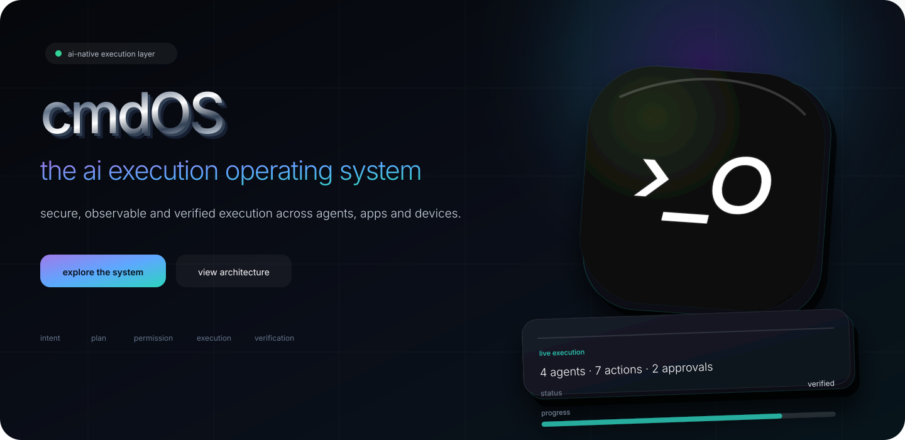
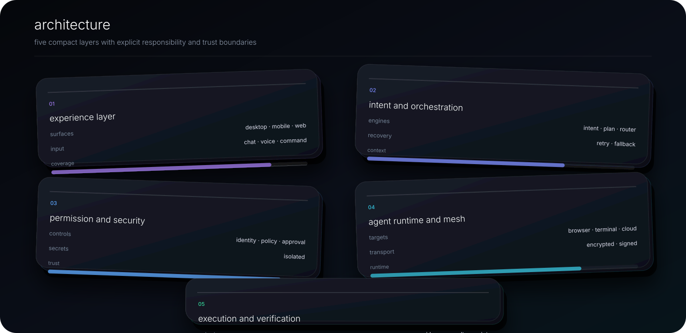
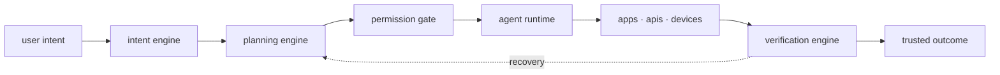
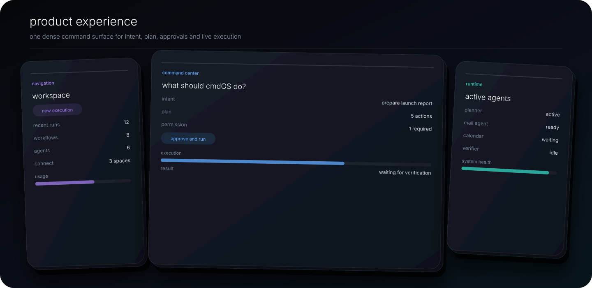
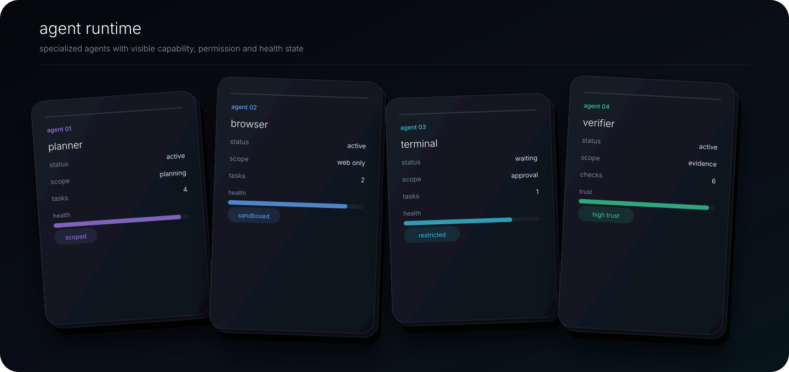
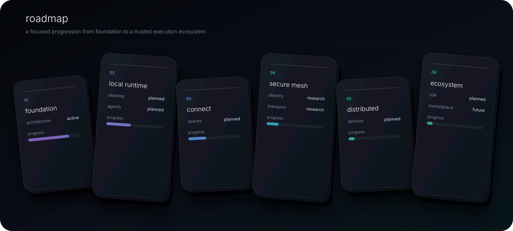
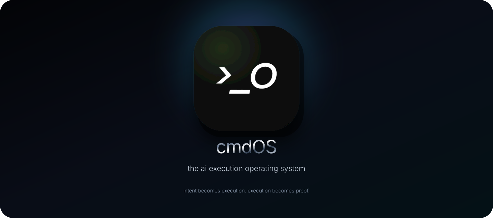

<div align="center">



<br />

[](https://cmdos.xyz/)
[](https://x.com/cmdOS_xyz)
[](https://t.me/cmdOS_xyz)
[](mailto:hello@cmdos.xyz)

<br />

**intent → understanding → planning → permission → execution → verification**

cmdOS is an ai-native execution layer that turns natural-language intent into secure, observable and verifiable action across applications, agents, devices and digital environments.

[vision](#vision) · [architecture](#architecture) · [product](#product-experience) · [runtime](#agent-runtime) · [security](#security-model) · [roadmap](#roadmap)

</div>

---

## vision

most ai products stop at the answer.

cmdOS is designed for the next step: **execution**.

a user describes the desired outcome without needing to know commands, apis, integrations or workflow syntax. cmdOS interprets that intent, creates a plan, requests permission where required, coordinates specialized agents, executes across tools and verifies the final result.

```text
user intent
    ↓
ai understanding
    ↓
dynamic planning
    ↓
permission and policy
    ↓
agent execution
    ↓
evidence and verification
    ↓
trusted result
```

> the goal is not to make every application conversational.  
> the goal is to make intent executable.

---

## architecture



| layer | responsibility |
|---|---|
| **experience** | desktop, mobile, web, chat, voice and command interfaces |
| **intent and orchestration** | understand goals, build plans, route models and recover from failure |
| **permission and security** | identity, approval, policies, secrets and audit |
| **agent runtime and mesh** | execute through browser, terminal, desktop, mobile, cloud and edge |
| **execution and verification** | collect evidence, validate outcomes and return a trusted result |



---

## product experience



the core interaction remains simple:

```text
1. describe the outcome
2. review the interpreted goal
3. inspect the execution plan
4. approve sensitive actions
5. watch agents execute
6. receive a verified result
7. save the workflow when useful
```

### example intent

```text
“prepare the launch report, identify blockers,
email the team and schedule a review meeting tomorrow.”
```

### product surfaces

| surface | purpose |
|---|---|
| **command workspace** | describe outcomes and inspect the generated plan |
| **execution timeline** | follow agents, approvals, retries, tool calls and results |
| **cmdOS connect** | bring people and ai agents into the same operational context |
| **workflow studio** | turn successful executions into reusable systems |
| **security center** | control permissions, devices, secrets and policies |

---

## cmdOS connect


cmdOS connect is the communication layer for agent-native teams.

agents can:

- join approved spaces;
- respond to mentions;
- summarize decisions;
- create tasks;
- execute authorized workflows;
- provide evidence;
- request human approval.

```text
discussion
   ↓
decision
   ↓
agent assignment
   ↓
permission
   ↓
execution
   ↓
verified update in the same conversation
```

---

## agent runtime



the runtime manages specialized execution agents across trusted environments.

| target | example capability |
|---|---|
| **browser** | navigate websites and operate web applications |
| **desktop** | interact with local applications and files |
| **terminal** | run commands, tests, builds and developer workflows |
| **mobile** | perform approved device-level actions |
| **cloud** | access remote apis and infrastructure |
| **edge** | execute near devices or private environments |

```text
idle
  ↓
assigned
  ↓
planning
  ↓
waiting for permission
  ↓
executing
  ↓
verifying
  ↓
completed
```

---

## ai router


no single model should handle every task.

the router evaluates:

- task type;
- reasoning depth;
- latency;
- cost;
- privacy;
- context length;
- tool support;
- reliability;
- user policy.

| workload | preferred route |
|---|---|
| sensitive local task | local model |
| fast classification | lightweight model |
| deep planning | strong reasoning model |
| coding | code-specialized model |
| vision | multimodal model |
| high reliability | ensemble or verifier route |

---

## secure agent mesh


the secure agent mesh enables approved devices and agents to exchange capabilities and signed results.

### mesh principles

- explicit device trust;
- agent identity;
- capability negotiation;
- scoped delegation;
- encrypted transport;
- signed results;
- revocation;
- auditability.

```text
mobile intent
   ↓
desktop planner
   ↓
workstation execution agent
   ↓
verifier agent
   ↓
signed result
   ↓
mobile notification
```

---

## security model


cmdOS follows a permission-first, zero-trust execution model.

### planned controls

- scoped permissions;
- one-time approvals;
- capability isolation;
- sandboxed execution;
- policy evaluation;
- encrypted secrets;
- signed agents and plugins;
- trusted device registry;
- execution limits;
- emergency stop;
- immutable audit events;
- result verification.

### permission request

```text
permission required

action:
send “weekly product report” to leadership@example.com

agent:
communication agent

data leaving device:
1 approved pdf

scope:
one-time send

[reject] [review details] [approve]
```

---

## workflow studio



successful executions can become reusable workflows containing:

- intent definitions;
- agent assignments;
- tool calls;
- permission gates;
- conditions;
- verification steps;
- final result delivery.

| block | role |
|---|---|
| **intent** | defines the desired outcome and constraints |
| **agent** | assigns a specialized capability |
| **tool** | connects an application, api, device or service |
| **permission** | pauses execution for authorization |
| **condition** | selects the next path based on state or evidence |
| **verification** | confirms whether the expected outcome was achieved |
| **result** | stores, shares or delivers the verified output |

---

## developer platform

cmdOS is intended to support an ecosystem of agents, tools, connectors and reusable workflows.

### agent sdk

defines planning, execution, verification, recovery and lifecycle contracts.

### tool sdk

provides permissioned interfaces to applications, apis, files, devices and services.

### workflow sdk

packages repeatable execution systems with explicit inputs, controls and expected outcomes.

```yaml
agent:
  name: release-verifier
  version: 0.1.0

capabilities:
  - inspect_build
  - run_tests
  - verify_release

permissions:
  - repository:read
  - deployment:approve

outputs:
  - verification_report
  - evidence_bundle
```

---

## roadmap



### 01 · foundation

- canonical product architecture;
- execution lifecycle;
- permission model;
- design system;
- public documentation.

### 02 · local runtime

- desktop command workspace;
- local agents;
- browser and terminal tools;
- local model integration;
- execution timeline.

### 03 · cmdOS connect

- human and agent workspaces;
- mentions and delegated tasks;
- shared execution context;
- mobile approvals.

### 04 · secure agent mesh

- trusted devices;
- agent identity;
- encrypted transport;
- capability negotiation;
- signed results.

### 05 · distributed execution

- cross-device scheduling;
- remote capabilities;
- workload routing;
- recovery and retry;
- multi-agent verification.

### 06 · ecosystem

- agent sdk;
- tool sdk;
- workflow sdk;
- marketplace and distribution;
- enterprise policy controls.

> roadmap items describe product direction and are not commitments to a specific release date.

---

## project status

cmdOS is currently in the product architecture and early development stage.

| area | status |
|---|---|
| brand and positioning | active |
| product architecture | in development |
| public website | available |
| desktop runtime | planned |
| mobile companion | planned |
| cmdOS connect | planned |
| secure agent mesh | research |
| developer sdk | planned |

---

## community

<div align="center">



[website](https://cmdos.xyz/) · [x](https://x.com/cmdOS_xyz) · [telegram](https://t.me/cmdOS_xyz) · [email](mailto:hello@cmdos.xyz)

<br />

<sub>cmdOS · the ai execution operating system</sub>

</div>
