<div align="center">


<br />

[](https://cmdos.xyz/)
[](https://x.com/cmdOS_xyz)
[](https://t.me/cmdOS_xyz)
[](mailto:hello@cmdos.xyz)

**Intent → Understanding → Planning → Permission → Execution → Verification**

cmdOS is an AI-native execution layer that turns natural-language intent into secure, observable and verifiable action across applications, devices and digital environments.

[Vision](#vision) · [Platform](#platform) · [Architecture](#architecture) · [Product](#product-experience) · [Roadmap](#roadmap) · [Community](#community)

</div>

---

## Vision

Most AI products stop at the answer.

cmdOS is designed for the next step: **execution**.

A user should be able to describe an outcome without knowing commands, APIs, integrations or workflow syntax. cmdOS interprets that intent, creates a plan, requests permission where required, coordinates specialized agents, executes across tools, and verifies the final result.

```text
User Intent
    ↓
AI Understanding
    ↓
Dynamic Planning
    ↓
Permission & Policy
    ↓
Agent Execution
    ↓
Evidence & Verification
    ↓
Trusted Result
```

> The goal is not to make every application conversational.  
> The goal is to make intent executable.

---

## Platform


cmdOS is positioned between the user and the environments where work happens.

| Layer | Responsibility |
|---|---|
| **Experience** | Desktop, mobile, web, chat, voice and command interfaces |
| **Intent** | Understand goals, context, constraints and success criteria |
| **Orchestration** | Plan tasks, route models, assign agents and recover from failure |
| **Trust** | Identity, permissions, policies, secrets, isolation and audit |
| **Runtime** | Execute through browser, terminal, desktop, mobile, cloud and edge agents |
| **Verification** | Collect evidence, validate outcomes and produce execution receipts |

### Core product surfaces

| Product surface | Purpose |
|---|---|
| **Command Workspace** | Describe outcomes and inspect the generated plan |
| **Execution Timeline** | Follow agents, approvals, retries, tool calls and results |
| **cmdOS Connect** | Bring people and AI agents into the same operational conversation |
| **Agent Runtime** | Run specialized capabilities across trusted environments |
| **Workflow Studio** | Turn successful executions into reusable systems |
| **Security Center** | Control permissions, devices, secrets and execution policies |

---

## Why cmdOS

### AI that acts

Traditional AI generates text. cmdOS is designed to coordinate real execution.

### Control before autonomy

Sensitive actions are visible, scoped and permissioned before they run.

### Local-first by design

Private tasks should execute locally whenever the required capability is available.

### Observable execution

The user can inspect what is happening, which agent is acting, what data is used and what remains blocked.

### Verification, not assumption

An attempted action is not treated as success. cmdOS collects evidence and validates the result.

### Human and agent collaboration

People and agents can share conversations, decisions, files, workflows and execution context.

---

## Trusted Execution


Every meaningful workflow follows the same trust model:

1. **Understand** — capture the goal, context, constraints and definition of success.
2. **Orchestrate** — select the appropriate models, agents, tools and fallback paths.
3. **Authorize** — expose high-impact actions and request explicit permission.
4. **Execute** — run scoped operations through trusted runtimes.
5. **Verify** — confirm the required outcome with evidence.

### Execution receipt

```json
{
  "goal": "Send the approved weekly report to leadership",
  "status": "verified",
  "executed_by": "communication-agent",
  "approved_by": "user",
  "evidence": [
    "approval-receipt",
    "document-hash",
    "mail-provider-delivery-id"
  ]
}
```

### Permission request

```text
Permission required

Action:
Send “Weekly Product Report” to leadership@example.com

Agent:
Communication Agent

Data leaving device:
1 approved PDF

Scope:
One-time send

[Reject] [Review details] [Approve]
```

---

## Architecture


### Experience layer

Captures intent through desktop, mobile, web, command, chat and voice interfaces.

### Intent and orchestration layer

Interprets goals, builds dynamic plans, routes models, delegates work and manages recovery.

### Permission and security layer

Evaluates identity, policies, approval requirements, data boundaries and secrets.

### Agent runtime and mesh

Coordinates specialized agents across local devices, browsers, terminals, cloud services and trusted peers.

### Execution and verification layer

Performs actions, records evidence, validates outcomes and returns a trusted result.

### Logical flow

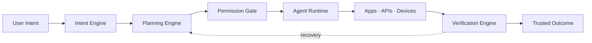

---

## Product Experience

### Command workspace

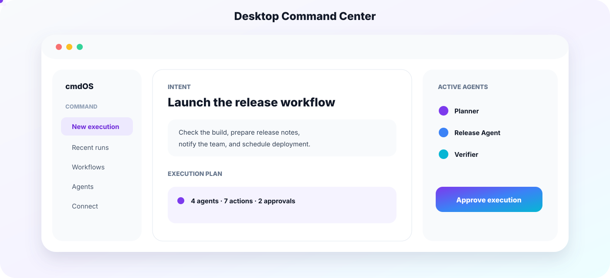

The desktop workspace combines intent, planning, approvals, active agents, execution progress and verified output in one operational surface.

### Mobile companion

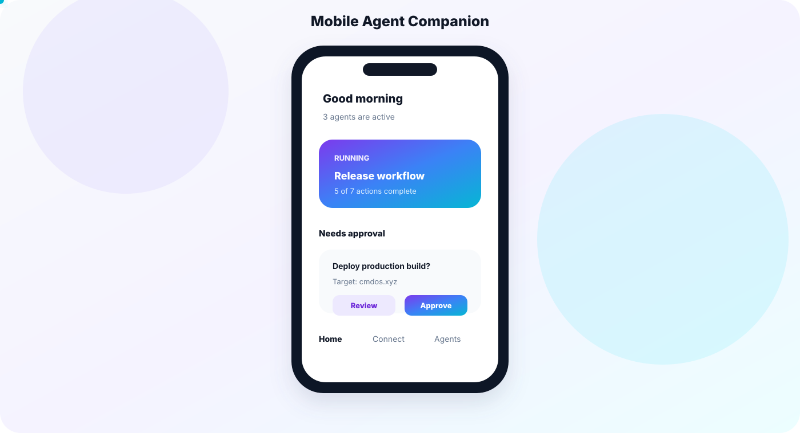

The mobile experience focuses on supervision:

- approve or reject sensitive actions;
- inspect active workflows;
- receive verified completion alerts;
- continue conversations with agents;
- control trusted devices;
- revoke permissions immediately.

### cmdOS Connect

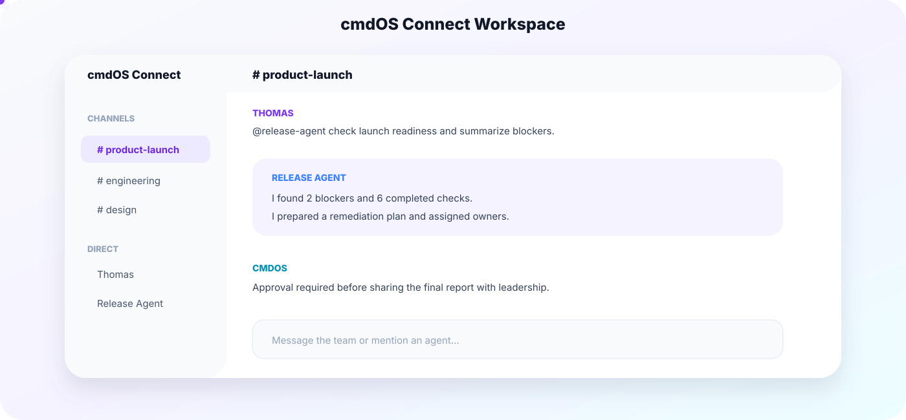

Connect places humans and agents in the same context. A conversation can become an executable workflow without copying information into a separate automation product.

### Workflow Studio

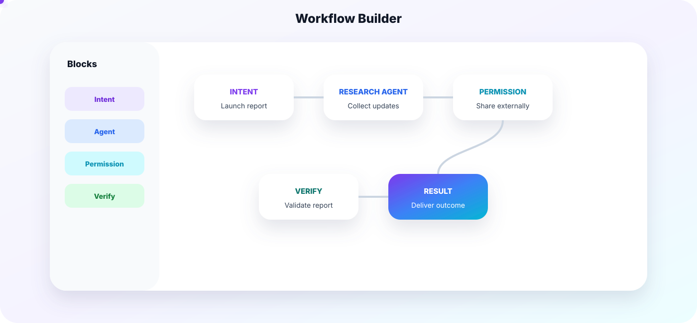

Successful executions can be converted into reusable workflows containing:

- intent definitions;
- agent assignments;
- tool calls;
- permission gates;
- conditions;
- verification steps;
- final result delivery.

### Agent operations

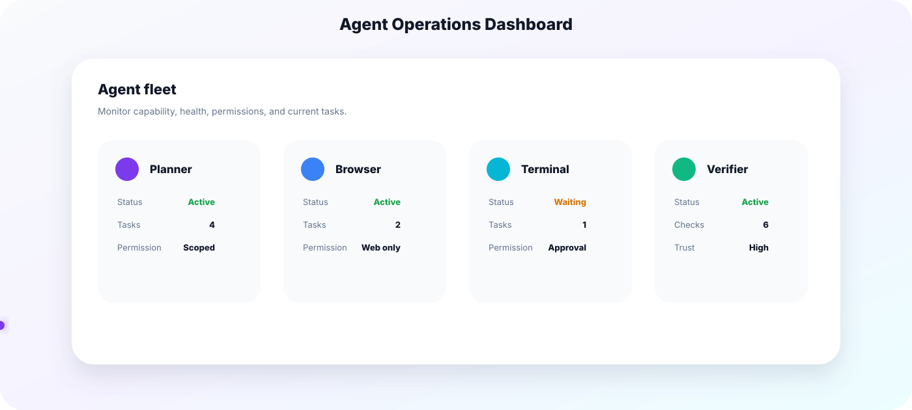

Each agent exposes its current task, capability set, permission scope, execution history, trust state, resource use and verification status.

---

## Product Preview


The core interaction is deliberately simple:

```text
1. Describe the outcome
2. Review the interpreted goal
3. Inspect the execution plan
4. Approve sensitive actions
5. Watch agents execute
6. Receive a verified result
7. Save the workflow when useful
```

### Example intent

```text
“Prepare the launch report, identify blockers,
email the team and schedule a review meeting tomorrow.”
```

### Example plan

```yaml
goal: prepare_and_distribute_launch_report

constraints:
  - use approved internal sources
  - exclude customer-identifying information
  - require approval before external delivery

steps:
  - collect_project_updates
  - identify_blockers
  - draft_report
  - verify_sources
  - request_delivery_approval
  - send_report
  - schedule_review
  - confirm_delivery
```

---

## Use Cases

### Product and operations

```text
“Summarize this week’s updates, identify blockers,
create an executive report and schedule the review.”
```

### Software development

```text
“Investigate the failed deployment, prepare a patch,
run the tests and open a pull request for review.”
```

### Research

```text
“Compare the available approaches, preserve sources,
produce a decision memo and flag uncertain claims.”
```

### Communication

```text
“Draft the announcement, collect approvals,
publish it to the selected channels and verify delivery.”
```

### Multi-device execution

```text
“Render the project on my workstation and notify me
on mobile when the verified output is available.”
```

---

## cmdOS Connect

cmdOS Connect is the communication layer for agent-native teams.

### Human conversations

- direct messages;
- private and public spaces;
- files and threads;
- voice and video;
- shared decisions;
- execution history.

### Agent participation

Agents can:

- join approved spaces;
- respond to mentions;
- summarize decisions;
- create tasks;
- execute authorized workflows;
- provide evidence;
- request human approval.

### Conversation to execution

```text
Discussion
   ↓
Decision
   ↓
Agent assignment
   ↓
Permission
   ↓
Execution
   ↓
Verified update in the same conversation
```

---

## Agent Runtime

The runtime manages the lifecycle of specialized execution agents.

### Agent responsibilities

- receive a scoped task;
- inspect available capabilities;
- request missing permission;
- perform tool calls;
- report progress;
- recover from expected failure;
- produce evidence;
- return a structured result.

### Runtime targets

| Target | Example capability |
|---|---|
| **Browser** | Navigate websites and operate web applications |
| **Desktop** | Interact with local applications and files |
| **Terminal** | Run commands, tests, builds and developer workflows |
| **Mobile** | Perform approved device-level actions |
| **Cloud** | Access remote APIs and infrastructure |
| **Edge** | Execute near devices or private environments |

### Agent state

```text
Idle
  ↓
Assigned
  ↓
Planning
  ↓
Waiting for permission
  ↓
Executing
  ↓
Verifying
  ↓
Completed
```

Possible terminal states:

- completed;
- partially completed;
- blocked;
- rejected;
- cancelled;
- verification failed;
- rolled back.

---

## AI Router

No single model should handle every task.

The AI Router selects models according to:

- task type;
- required reasoning depth;
- latency;
- cost;
- privacy;
- context length;
- tool support;
- reliability;
- user policy.

```text
Intent
  ↓
Task classification
  ↓
Privacy and policy evaluation
  ↓
Model selection
  ↓
Execution
  ↓
Quality evaluation
  ↓
Fallback or completion
```

### Routing strategy

| Workload | Preferred route |
|---|---|
| Sensitive local task | Local model |
| Fast classification | Lightweight model |
| Deep planning | Strong reasoning model |
| Coding | Code-specialized model |
| Vision | Multimodal model |
| High reliability | Ensemble or verifier route |

---

## Secure Agent Mesh

The Secure Agent Mesh enables approved agents and devices to collaborate without exposing unrestricted control.

### Mesh principles

- explicit device trust;
- agent identity;
- capability negotiation;
- scoped delegation;
- encrypted transport;
- signed results;
- revocation;
- auditability.

### Distributed execution example

```text
Mobile intent
   ↓
Desktop planner
   ↓
Workstation render agent
   ↓
Verifier agent
   ↓
Signed result
   ↓
Mobile notification
```

---

## Security Model

cmdOS follows a permission-first, zero-trust execution model.

### Planned controls

- scoped permissions;
- one-time approvals;
- capability isolation;
- sandboxed execution;
- policy evaluation;
- encrypted secrets;
- signed agents and plugins;
- trusted device registry;
- execution limits;
- emergency stop;
- immutable audit events;
- result verification.

### Data principles

- collect the minimum required data;
- keep private execution local when possible;
- separate credentials from model context;
- expose data movement before approval;
- make permissions revocable;
- avoid treating model output as trusted by default.

> Security controls described here represent the intended architecture and must be independently validated before production deployment.

---

## Developer Platform

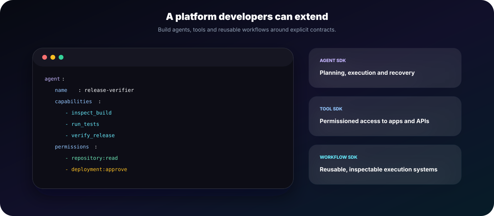

cmdOS is intended to support an ecosystem of agents, tools, connectors and reusable workflows.

### Agent SDK

Defines planning, execution, verification, recovery and lifecycle contracts.

### Tool SDK

Provides permissioned interfaces to applications, APIs, files, devices and services.

### Workflow SDK

Packages repeatable execution systems with explicit inputs, controls and expected outcomes.

### Example agent manifest

```yaml
agent:
  name: release-verifier
  version: 0.1.0

capabilities:
  - inspect_build
  - run_tests
  - verify_release

permissions:
  - repository:read
  - deployment:approve

outputs:
  - verification_report
  - evidence_bundle
```

### Example tool contract

```typescript
export interface CmdOSTool<Input, Output> {
  name: string;
  permissions: string[];
  validate(input: Input): Promise<void>;
  execute(input: Input, context: ExecutionContext): Promise<Output>;
  verify(output: Output, context: VerificationContext): Promise<Evidence[]>;
}
```

---

## How cmdOS Is Different

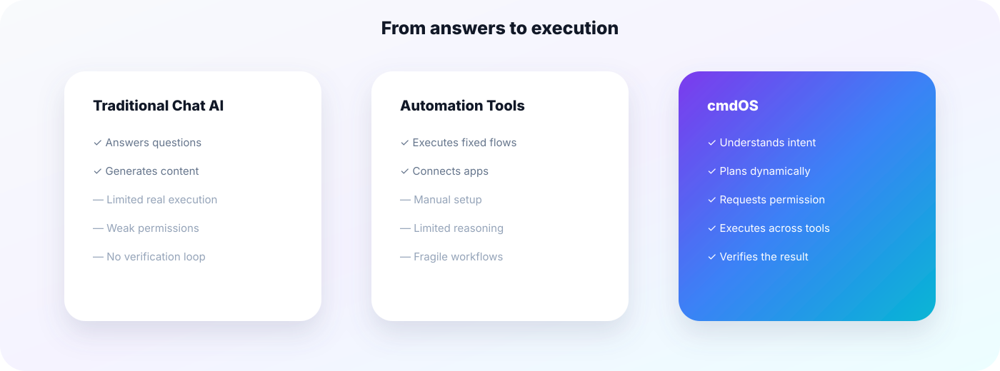

| Capability | Chat AI | Automation platforms | cmdOS |
|---|:---:|:---:|:---:|
| Understand open-ended intent | ✅ | Limited | ✅ |
| Build a dynamic plan | Limited | ❌ | ✅ |
| Ask for contextual approval | Limited | Limited | ✅ |
| Execute across apps and devices | Limited | ✅ | ✅ |
| Recover when a step fails | Limited | Limited | ✅ |
| Verify the final outcome | ❌ | Limited | ✅ |
| Coordinate humans and agents | Limited | Limited | ✅ |
| Support local-first execution | Limited | Limited | Planned |

---

## Design Principles

### Intent first

Users define the outcome instead of assembling low-level triggers and actions.

### Permission before power

High-impact actions remain visible and controlled.

### Evidence over confidence

The system proves outcomes instead of presenting unverified claims as completion.

### Local when practical

Execution remains close to private data and trusted devices.

### Composable architecture

Models, agents, tools and workflows can evolve independently.

### Calm product design

The interface should make complex execution understandable rather than visually overwhelming.

---

## Roadmap

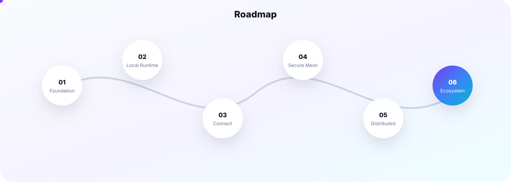

### 01 · Foundation

- canonical product architecture;
- execution lifecycle;
- permission model;
- design system;
- public documentation.

### 02 · Local Runtime

- desktop command workspace;
- local agents;
- browser and terminal tools;
- local model integration;
- execution timeline.

### 03 · cmdOS Connect

- human and agent workspaces;
- mentions and delegated tasks;
- shared execution context;
- mobile approvals.

### 04 · Secure Agent Mesh

- trusted devices;
- agent identity;
- encrypted transport;
- capability negotiation;
- signed results.

### 05 · Distributed Execution

- cross-device scheduling;
- remote capabilities;
- workload routing;
- recovery and retry;
- multi-agent verification.

### 06 · Ecosystem

- Agent SDK;
- Tool SDK;
- Workflow SDK;
- marketplace and distribution;
- enterprise policy controls.

> Roadmap items describe product direction and are not commitments to a specific release date.

---

## Project Status

cmdOS is currently in the product architecture and early development stage.

| Area | Status |
|---|---|
| Brand and positioning | Active |
| Product architecture | In development |
| Public website | Available |
| Desktop runtime | Planned |
| Mobile companion | Planned |
| cmdOS Connect | Planned |
| Secure Agent Mesh | Research |
| Developer SDK | Planned |

---

## Repository Structure

```text
cmdOS/
├── apps/
│   ├── desktop/
│   ├── mobile/
│   ├── web/
│   └── connect/
├── packages/
│   ├── agent-runtime/
│   ├── ai-router/
│   ├── permission-engine/
│   ├── verification-engine/
│   ├── workflow-sdk/
│   ├── tool-sdk/
│   └── ui/
├── services/
│   ├── orchestration/
│   ├── identity/
│   ├── mesh/
│   └── audit/
├── docs/
├── examples/
└── README.md
```

This structure represents the intended platform organization rather than a claim that every component is currently implemented.

---

## Frequently Asked Questions

<details>
<summary><strong>Is cmdOS a traditional operating system?</strong></summary>

Not in the kernel sense. cmdOS is an AI-native execution layer designed to coordinate models, agents, tools, applications, devices, permissions and verified outcomes.

</details>

<details>
<summary><strong>Is cmdOS only for crypto?</strong></summary>

No. cmdOS is designed as a general-purpose execution platform for productivity, development, research, operations, communication, devices and digital services.

</details>

<details>
<summary><strong>Does cmdOS replace existing applications?</strong></summary>

No. It is designed to operate across existing applications and services through a unified intent, permission, execution and verification layer.

</details>

<details>
<summary><strong>Can cmdOS work locally?</strong></summary>

Local-first execution is a core design principle. Local models, agents and storage should be used whenever practical, with cloud services remaining optional for workloads that require them.

</details>

<details>
<summary><strong>Are all features shown here available?</strong></summary>

No. This README communicates the product vision, architecture and intended experience. The project status and roadmap separate current work from planned capabilities.

</details>

---

## Community

<div align="center">

### Building the execution layer for an agent-native world.

[Website](https://cmdos.xyz/) · [X](https://x.com/cmdOS_xyz) · [Telegram](https://t.me/cmdOS_xyz) · [Email](mailto:hello@cmdos.xyz)

<br />


<sub>cmdOS · The AI Execution Operating System</sub>

</div>
