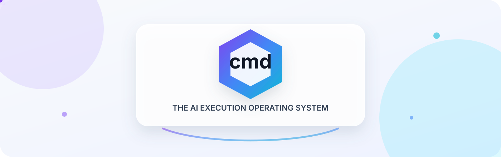
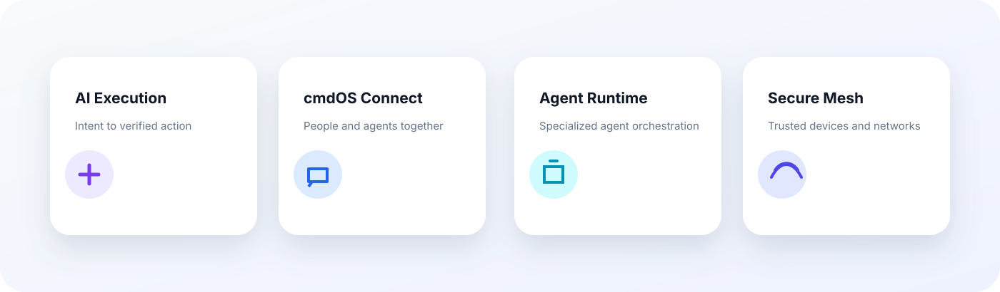
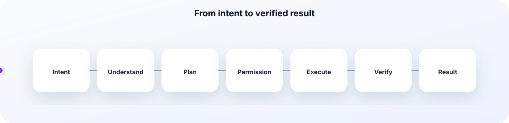
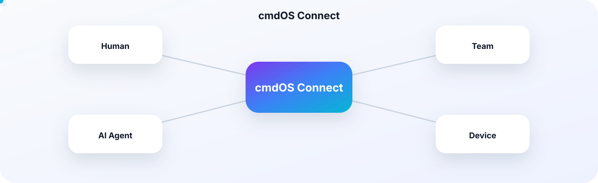
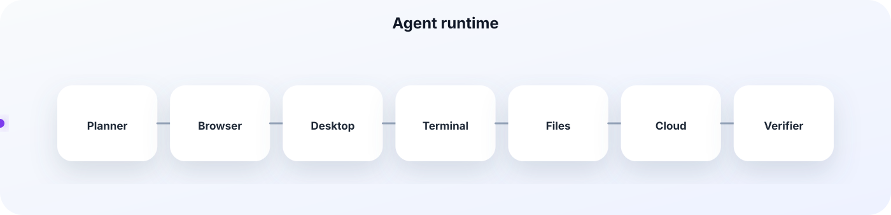
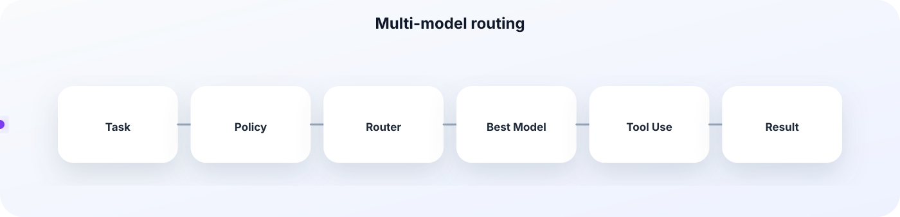
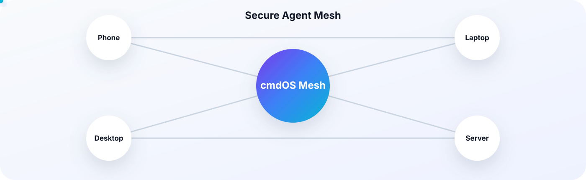
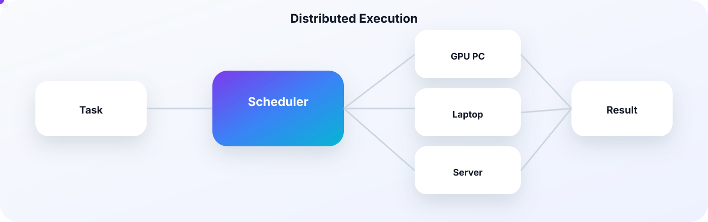
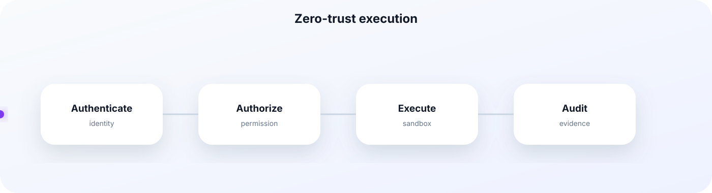

<div align="center">



# cmdOS

### The AI Execution Operating System

**A secure operating layer where humans and AI agents communicate, collaborate, and execute real work across apps, devices, and networks.**

<br/>

[](https://cmdos.xyz/)
[](https://x.com/cmdOS_xyz)
[](https://t.me/cmdOS_xyz)
[](#project-status)

<br/>

[Vision](#vision) · [Product](#product) · [Architecture](#architecture) · [Connect](#cmdos-connect) · [Roadmap](#roadmap)

</div>

---

## Vision

cmdOS is being built as an **AI-native execution operating system**.

Most AI products stop at conversation. cmdOS is designed to continue from intent to verified action:

```text
Intent → Understanding → Planning → Permission → Execution → Verification → Result
```

The long-term platform combines:

- **AI Execution**
- **Secure Human Communication**
- **Agent-to-Agent Collaboration**
- **Distributed Device Execution**
- **Local-first Privacy**
- **Multi-model Routing**

---

## Product

<div align="center">
  
</div>

### 01 — AI Execution

Turn natural language into structured, permission-aware workflows.

### 02 — cmdOS Connect

Enable humans, teams, and AI agents to communicate in one secure workspace.

### 03 — Agent Runtime

Coordinate specialized agents across browser, desktop, terminal, mobile, files, and cloud.

### 04 — Secure Agent Mesh

Connect trusted users, devices, and agents through Internet, LAN, P2P, Wi-Fi Direct, and proximity networking where supported.

---

## Why cmdOS

```text
People
   ↓
Intent
   ↓
AI Planning
   ↓
Permission
   ↓
Execution
   ↓
Verification
   ↓
Trusted Result
```

cmdOS is intended to bridge the gap between **what a user wants** and **what software actually does**.

---

## AI Execution Flow

<div align="center">
  
</div>

### Execution principles

- Human approval before sensitive actions
- Clear permissions and boundaries
- Visible execution state
- Recoverable workflows
- Verifiable outcomes
- Local execution whenever practical
- Provider-flexible AI routing

---

## cmdOS Connect

<div align="center">
  
</div>

cmdOS Connect is the communication layer for:

```text
Human ↔ Human
Human ↔ AI Agent
AI Agent ↔ AI Agent
Team ↔ AI Agents
Device ↔ Device
```

### Human communication

- Direct messages
- Group chat
- Team workspaces
- Public and private channels
- Password-protected rooms
- Mentions
- Replies
- Reactions
- Pinned messages
- Favorites
- Message search
- File sharing
- Prompt sharing
- Workflow sharing
- Disappearing messages
- Voice messages
- Voice/video calls
- Screen sharing
- AI summaries and translation

### AI inside chat

```text
Thomas:
@research-agent summarize today's discussion
and create a project plan.

Research Agent:
I found 6 decisions and 11 action items.
The plan is ready.

cmdOS:
Permission required:
Share "Project Plan v1" with 8 members?

Thomas:
Approve.

cmdOS:
Shared successfully.
```

---

## Agent Runtime

<div align="center">
  
</div>

Planned agent types:

- Browser Agent
- Desktop Agent
- Terminal Agent
- Mobile Agent
- File Agent
- Communication Agent
- Cloud Agent
- Research Agent
- Coding Agent
- Verification Agent
- Security Agent

The runtime coordinates:

- task delegation;
- agent lifecycle;
- tool permissions;
- retries;
- fallback paths;
- resource limits;
- execution traces;
- verification.

---

## AI Router

<div align="center">
  
</div>

The AI Router selects the right model based on:

- capability;
- latency;
- cost;
- privacy;
- context length;
- availability;
- local hardware;
- user preference;
- organization policy.

Target model categories:

- OpenAI
- Anthropic Claude
- Google Gemini
- Kimi
- GLM
- Local LLMs
- Specialized models

---

## Secure Agent Mesh

<div align="center">
  
</div>

The Secure Agent Mesh is intended to connect trusted users, agents, and devices.

Possible transports:

- Internet
- LAN
- Peer-to-peer
- Wi-Fi Direct
- Bluetooth proximity communication
- Trusted relay nodes
- Store-and-forward delivery

Potential mesh payloads:

- encrypted messages;
- task requests;
- signed results;
- approved files;
- workflow definitions;
- device capabilities;
- execution receipts.

---

## Distributed Execution

<div align="center">
  
</div>

Examples:

- Run a local model on a stronger desktop
- Send rendering work to a GPU workstation
- Execute a build on a trusted server
- Continue a workflow on another device
- Delegate a mobile-only action to a paired phone
- Verify results remotely

Resource sharing must remain:

- opt-in;
- permission-controlled;
- time-limited;
- revocable;
- auditable.

---

## Security Model

<div align="center">
  
</div>

cmdOS follows a zero-trust execution philosophy.

Every:

- user;
- device;
- agent;
- plugin;
- tool;
- task;
- network request;

must be authenticated, authorized, scoped, and auditable.

### Planned security controls

- Capability-based permissions
- Sandboxed execution
- Per-tool authorization
- Signed plugins
- Task-level policies
- Approval checkpoints
- Network allowlists
- Resource limits
- Emergency revoke
- Signed execution results
- Encrypted local storage
- Replay protection
- Key rotation

---

## Local-first by Design

- Local execution whenever practical
- Local storage by default
- Optional cloud services
- Minimum necessary disclosure
- User-controlled retention
- Explicit external transmission
- No silent agent execution
- No advertising identity layer
- No unauthorized AI training on private content

---

## Architecture

```text
┌──────────────────────────────────────────────────────────────┐
│                        EXPERIENCE LAYER                      │
│  Desktop · Mobile · Web · Chat · Command UI · Voice          │
├──────────────────────────────────────────────────────────────┤
│                    COMMUNICATION LAYER                       │
│  Direct Messages · Groups · Rooms · Files · Calls · AI       │
├──────────────────────────────────────────────────────────────┤
│                       INTENT LAYER                           │
│  Understanding · Context · Constraints · Risk                │
├──────────────────────────────────────────────────────────────┤
│                   ORCHESTRATION LAYER                        │
│  Planner · Router · Workflow · Recovery · Scheduling         │
├──────────────────────────────────────────────────────────────┤
│                    PERMISSION LAYER                          │
│  Policies · Approval · Secrets · Identity · Audit            │
├──────────────────────────────────────────────────────────────┤
│                      AGENT RUNTIME                           │
│  Browser · Desktop · Terminal · Mobile · Files · Cloud       │
├──────────────────────────────────────────────────────────────┤
│                  SECURE AGENT MESH                           │
│  Internet · LAN · P2P · Wi-Fi Direct · Bluetooth · Relay    │
├──────────────────────────────────────────────────────────────┤
│                   EXECUTION TARGETS                          │
│  Apps · Files · Devices · APIs · Services · Infrastructure   │
├──────────────────────────────────────────────────────────────┤
│                 VERIFICATION & RESULTS                       │
│  Evidence · Validation · Outcome · Execution Trace           │
└──────────────────────────────────────────────────────────────┘
```

---


## Product Preview

<div align="center">
  
</div>

The interface is designed around one central interaction: describe the outcome, inspect the plan, approve sensitive actions, and watch execution happen in real time.

### Product surfaces

| Surface | Purpose |
|---|---|
| **Command Workspace** | Convert natural-language intent into an executable plan |
| **Execution Timeline** | Show every agent, tool call, approval, retry, and result |
| **cmdOS Connect** | Bring people and AI agents into the same secure conversation |
| **Agent Console** | Inspect active agents, permissions, state, and resource use |
| **Workflow Studio** | Save, reuse, and share repeatable execution patterns |
| **Security Center** | Manage trusted devices, policies, secrets, and audit history |

---

## How cmdOS Is Different

<div align="center">
  
</div>

| Capability | Traditional Chat AI | Automation Platforms | cmdOS |
|---|:---:|:---:|:---:|
| Understand open-ended intent | ✅ | Limited | ✅ |
| Build a dynamic plan | Limited | ❌ | ✅ |
| Ask for contextual approval | Limited | Limited | ✅ |
| Execute across apps and devices | Limited | ✅ | ✅ |
| Recover when a step fails | Limited | Limited | ✅ |
| Verify the final outcome | ❌ | Limited | ✅ |
| Coordinate humans and agents | Limited | Limited | ✅ |
| Work locally and through secure mesh | ❌ | ❌ | Planned |

---

## Experience Principles

### Intent first

The user describes the desired outcome instead of manually assembling APIs, triggers, and action blocks.

### Permission before power

Sensitive actions must remain visible, scoped, and explicitly approved.

### Execution you can inspect

Every meaningful action should expose its status, agent, target, evidence, and result.

### Local when possible

Private tasks should run locally whenever the required capability is available.

### Human and AI collaboration

Agents should participate in conversations, teams, and workflows without replacing human control.

---

## Premium Architecture View

<div align="center">
  
</div>

Each layer has a distinct responsibility:

1. **Experience Layer** — captures user intent through desktop, mobile, web, chat, voice, and command interfaces.
2. **Intent & Orchestration** — interprets goals, creates plans, selects models, routes tasks, and handles recovery.
3. **Permission & Security** — verifies identity, evaluates policies, protects secrets, and records approvals.
4. **Agent Runtime & Mesh** — coordinates specialized agents across devices and trusted networks.
5. **Execution & Verification** — performs actions, gathers evidence, validates outcomes, and returns results.

---

## Product Scenarios

### Executive workflow

```text
"Summarize the latest project updates, identify blockers,
send a report to leadership, and book a review meeting."
```

cmdOS can coordinate research, files, communication, and calendar actions while pausing for approval before external delivery.

### Developer workflow

```text
"Investigate the failed deployment, identify the likely cause,
prepare a patch, run the tests, and open a pull request."
```

The runtime can delegate work to coding, terminal, browser, and verification agents while preserving an execution trace.

### Team collaboration

```text
"Create a private launch room, invite the release team,
pin the checklist, and assign an agent to summarize decisions."
```

cmdOS Connect combines human communication with agent participation and workflow execution.

### Multi-device workflow

```text
"Render this project on my workstation and notify me
on mobile when the verified output is ready."
```

Distributed execution allows approved work to move between trusted devices based on capability and availability.

---


## Product Experience

cmdOS is designed as a coherent operating environment rather than a collection of disconnected AI tools.

### Desktop Command Center

<div align="center">
  
</div>

The desktop experience is the primary control surface for complex execution. It combines natural-language intent, agent activity, approval gates, execution progress, and verified results in one workspace.

### Mobile Agent Companion

<div align="center">
  
</div>

The mobile app is designed for fast supervision:

- approve or reject sensitive actions;
- receive verified completion alerts;
- continue conversations with agents;
- inspect active workflows;
- control trusted devices;
- revoke permissions immediately.

### cmdOS Connect Workspace

<div align="center">
  
</div>

Connect places people and agents in the same operational context. A conversation can become an executable workflow without moving information between separate products.

### Workflow Builder

<div align="center">
  
</div>

The Workflow Builder transforms successful executions into reusable systems.

Core block categories:

| Block | Role |
|---|---|
| **Intent** | Defines the desired outcome and constraints |
| **Agent** | Assigns a specialized capability |
| **Tool** | Connects an application, API, device, or service |
| **Permission** | Pauses execution for authorization or policy review |
| **Condition** | Selects the next path based on state or evidence |
| **Verification** | Confirms whether the required outcome was achieved |
| **Result** | Delivers, stores, or shares the verified output |

### Agent Operations Dashboard

<div align="center">
  
</div>

The dashboard makes autonomous activity observable.

Each agent exposes:

- current status;
- active task;
- capability set;
- permission scope;
- resource usage;
- trust level;
- execution history;
- recent errors;
- verification state.

---

## Interaction Model

cmdOS follows a predictable interaction cycle.

```text
1. Describe the desired outcome
2. Review the interpreted goal
3. Inspect the generated plan
4. Approve sensitive actions
5. Watch agents execute
6. Receive a verified result
7. Save the workflow when useful
```

### Example execution

```yaml
intent:
  goal: "Prepare and distribute the weekly product report"
  constraints:
    - use approved internal sources
    - do not share customer-identifying information
    - request approval before sending externally

plan:
  - collect_project_updates
  - identify_blockers
  - draft_report
  - verify_sources
  - request_delivery_approval
  - send_report
  - confirm_delivery

result:
  status: verified
  evidence:
    - report_file
    - approval_receipt
    - delivery_receipt
```

---

## Product Design System

### Visual language

The README preview uses the intended cmdOS product direction:

- bright neutral surfaces;
- soft gradient depth;
- purple, blue, and cyan execution accents;
- glass-like panels;
- rounded operational cards;
- clear state hierarchy;
- strong contrast for approvals and outcomes;
- minimal decorative noise.

### Status semantics

| State | Meaning |
|---|---|
| **Purple** | Intent, planning, or primary system intelligence |
| **Blue** | Active tool or agent execution |
| **Cyan** | Communication, network, or live transport |
| **Green** | Verified success |
| **Amber** | Waiting, review, or attention required |
| **Red** | Blocked, rejected, or security-sensitive |

### Core component families

- Command composer
- Execution timeline
- Agent card
- Permission gate
- Verification receipt
- Device card
- Connect message
- Workflow node
- Model routing panel
- Security policy card
- Result artifact card

---

## Execution States

Every workflow should expose a clear state.

```text
Draft
  ↓
Planning
  ↓
Ready for approval
  ↓
Executing
  ↓
Waiting for input
  ↓
Verifying
  ↓
Completed
```

Possible terminal states:

- Completed
- Partially completed
- Cancelled
- Rejected
- Blocked
- Verification failed
- Rolled back

---

## Permission Experience

Permissions are not hidden settings. They are part of the execution interface.

A permission request should explain:

1. **What** action will happen
2. **Why** the action is required
3. **Which** agent or tool will perform it
4. **Where** data will be sent
5. **What** scope is requested
6. **How long** the permission lasts
7. **How** the user can revoke it

Example:

```text
Permission required

Action:
Send "Weekly Product Report" to leadership@example.com

Agent:
Communication Agent

Data leaving device:
1 PDF report

Permission:
One-time send

[Reject] [Review details] [Approve]
```

---

## Verification Experience

cmdOS should distinguish between an action being attempted and an outcome being achieved.

Example verification evidence:

- file hash;
- API response;
- delivery receipt;
- application state;
- screenshot;
- test result;
- signed remote result;
- user confirmation;
- independent verifier agent.

A verified result can include:

```json
{
  "goal": "Send the approved report to leadership",
  "status": "verified",
  "executed_by": "communication-agent",
  "approved_by": "user",
  "evidence": [
    "approval-receipt",
    "mail-provider-delivery-id"
  ]
}
```

---

## Responsive Experience

The product hierarchy adapts across devices.

### Desktop

- Full planning and execution view
- Multi-agent visibility
- Workflow editing
- Advanced permission details
- Security and device management

### Mobile

- Fast approvals
- Notifications
- Conversation and supervision
- Emergency stop
- Trusted-device controls
- Compact execution receipts

### Web

- Shared workspaces
- Team collaboration
- Administrative controls
- Remote execution visibility
- Documentation and onboarding

## Visual Roadmap

<div align="center">
  
</div>

## Suggested Repository Structure

```text
cmdOS/
├── apps/
│   ├── desktop/
│   ├── mobile/
│   ├── web/
│   └── server/
├── core/
│   ├── intent/
│   ├── planner/
│   ├── permissions/
│   ├── runtime/
│   ├── router/
│   └── verification/
├── connect/
│   ├── messaging/
│   ├── rooms/
│   ├── calls/
│   ├── files/
│   └── presence/
├── network/
│   ├── identity/
│   ├── encryption/
│   ├── transport/
│   ├── relay/
│   └── sync/
├── agents/
├── plugins/
├── workflows/
├── packages/
├── sdk/
├── docs/
├── examples/
├── tests/
├── assets/
└── README.md
```

---

## Roadmap

### Phase 01 — Foundation

- [ ] Architecture specification
- [ ] Permission model
- [ ] Agent Runtime contract
- [ ] Execution trace format
- [ ] Identity model
- [ ] Security and threat model

### Phase 02 — Local Execution

- [ ] Desktop command interface
- [ ] Browser Agent
- [ ] Terminal Agent
- [ ] File Agent
- [ ] Local workflow engine
- [ ] Permission Gate
- [ ] Verification Engine
- [ ] Local model routing

### Phase 03 — cmdOS Connect

- [ ] Direct messages
- [ ] Group chat
- [ ] Team workspaces
- [ ] Public/private channels
- [ ] Mentions and replies
- [ ] Reactions
- [ ] Pinned/favorite messages
- [ ] Password-protected rooms
- [ ] Encrypted file transfer
- [ ] Voice messages
- [ ] AI inside conversations

### Phase 04 — Secure Agent Mesh

- [ ] Device identity
- [ ] Trusted-device pairing
- [ ] End-to-end encrypted messages
- [ ] LAN discovery
- [ ] P2P transport
- [ ] Wi-Fi Direct prototype
- [ ] Bluetooth proximity prototype
- [ ] Multi-hop encrypted relay
- [ ] Store-and-forward delivery
- [ ] Capability discovery

### Phase 05 — Distributed Execution

- [ ] Signed task envelopes
- [ ] Remote permission checks
- [ ] Remote Agent Runtime
- [ ] Resource-aware scheduling
- [ ] Signed execution results
- [ ] Remote cancellation
- [ ] Distributed verification

### Phase 06 — Ecosystem

- [ ] Developer SDK
- [ ] Plugin SDK
- [ ] Agent SDK
- [ ] Workflow SDK
- [ ] Plugin registry
- [ ] Self-hosted deployment
- [ ] External security audit
- [ ] Stable public release

---

## Project Status

cmdOS is under active design and development.

Some capabilities described here are **vision or roadmap targets**, not production-ready claims.

---


## Frequently Asked Questions

<details>
<summary><strong>Is cmdOS a traditional operating system?</strong></summary>

Not in the kernel sense. cmdOS is an AI-native execution layer designed to coordinate models, agents, tools, apps, devices, permissions, and verified results.

</details>

<details>
<summary><strong>Is cmdOS only for crypto?</strong></summary>

No. The platform is intended for general-purpose execution across productivity, software development, research, communication, operations, business workflows, devices, and digital services.

</details>

<details>
<summary><strong>Does cmdOS replace existing applications?</strong></summary>

No. It is designed to operate across existing applications and services, providing a unified intent, permission, execution, and verification layer.

</details>

<details>
<summary><strong>Can cmdOS work without the cloud?</strong></summary>

The architecture is local-first. Local models, local agents, and local storage should be used whenever practical, while cloud providers remain optional for tasks that require them.

</details>

<details>
<summary><strong>How does cmdOS prevent unsafe actions?</strong></summary>

The intended security model uses scoped permissions, policy evaluation, explicit approval checkpoints, sandboxing, signed components, execution limits, audit trails, and verification.

</details>

<details>
<summary><strong>Are all features in this README available today?</strong></summary>

No. This README represents the product direction and planned architecture. Roadmap items are clearly separated from production-ready claims.

</details>

---

## Built for an Agent-Native Future

AI is moving from generating content to coordinating real work.

cmdOS is designed for that transition:

```text
Chat → Intent
Intent → Plan
Plan → Permission
Permission → Execution
Execution → Verification
Verification → Trusted Result
```

The goal is not to make software more conversational.

The goal is to make **intent executable**.

## Community

- Website: https://cmdos.xyz/
- X: https://x.com/cmdOS_xyz
- Telegram: https://t.me/cmdOS_xyz
- Email: hello@cmdos.xyz

---

<div align="center">


### Building the AI Execution Operating System.

</div>


---

# Phase 4 — Developer Experience

## Tech Stack

- Frontend: React / Next.js
- Desktop: Tauri or Electron
- Mobile: React Native
- Backend: Rust / Go
- AI Routing: Multi-provider
- Local Models: Ollama / llama.cpp compatible
- Communication: WebSocket + secure transports
- Storage: Local-first with optional cloud sync

## Developer Experience

### Plugin SDK

Plugins declare:

- capabilities
- permissions
- tools
- events
- execution policies

### Agent SDK

Agents expose:

- planning
- execution
- verification
- recovery
- lifecycle hooks

### Workflow SDK

Reusable execution pipelines with approval checkpoints.

---

## Example Plugin Manifest

```yaml
name: mail-agent
version: 1.0.0

permissions:
  - mail.send

capabilities:
  - send_email
  - verify_delivery
```

---

## Example Agent Contract

```yaml
goal:
  execute_verified_task

inputs:
  intent
  permissions

outputs:
  verified_result
```

---

## Final Vision

cmdOS is intended to become the operating layer between people, AI models, applications, devices and real-world execution.

It emphasizes:

- Intent
- Planning
- Permission
- Execution
- Verification
- Trust
- Collaboration

